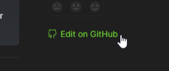

# FAQ

O que é Last.fm?

[Last.fm](https://last.fm/pt) é um site de música dedicado a agregar informações sobre as últimas faixas, artistas e álbuns que você escutou desde a criação da sua conta na plataforma.

Nele, você poderá ver tudo o que você escutou (scrobblou) na semana, ano e mês.

Como eu faço para utilizar o Last.fm?

Siga as etapas abaixo:

1. Crie seu perfil em [last.fm/pt/join](https://last.fm/pt/join);
2. Baixe os [scrobblers oficiais do Last.fm](https://www.last.fm/pt/about/trackmymusic);
3. Se você utiliza o Spotify, você poderá [conectar sua conta aqui](https://last.fm/pt/settings/applications);
4. Pronto, agora você pode [acessar seu perfil](https://www.last.fm/user/\_) e começar a scrobblar[^1].

Como eu faço para me verificar no servidor Last.fm Brasil?

Basta enviar o [link do seu perfil](https://www.last.fm/user/\_) ou nome de usuário no canal [#verificação](https://discord.com/channels/1043352417175085136/1051257047481589830) do nosso servidor. Após isso, aguarde até um moderador checar seu perfil para que você garanta acesso ao servidor.

Quero editar ou adicionar algumas páginas desse site, é possível?

Sim! Se você tem um profundo conhecimento sobre Last.fm, você poderá editar e adicionar páginas no site através do nosso [repositório no GitHub](https://github.com/lastfmbr/documentacao).

Para facilitar, encontre o botão [ **Edit on GitHub**](https://github.com/lastfmbr/documentacao) ao lado da página que deseja adicionar. [Atente-se às regras](https://github.com/lastfmbr/.github/tree/main/profile/README.md).

[^1]: "Scrobblar" é o mesmo que **escutar**. Esta é a forma que a plataforma usa para se direcionar as contagens de faixas.
