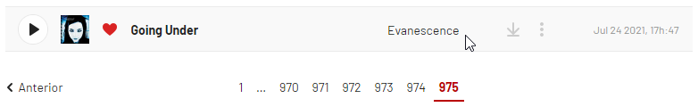
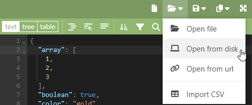

# 🟡 Importar Streams no Last.fm


**Importar seus scrobbles fará com que os seus relatórios (diário, semanal e anual) fiquem imprecisos.** Algumas pessoas gostam de receber dados precisos sobre seus hábitos de escuta (por exemplo, a data exata em que cada música foi transmitida). Se você é uma dessas pessoas, não continue.



Este guia foi criado por [comicxans](https://www.last.fm/user/comicxans) e traduzido e adaptado pela equipe do Last.fm Brasil. [Visite o guia original](https://docs.google.com/document/d/1IhFMol3wZs24uKnh2rbxHpLaxhETcfB8KqzYIkEW\_iM).


***

## Solicitando seus dados

### Spotify

1. Envie um email para o [privacy@spotify.com](mailto:privacy@spotify.com) entitulado **Requesting a Copy of My Extended Streaming History**. Tenha certeza de que está enviando este email pelo mesmo email que você utiliza no Spotify.
2. Copie e cole o modelo abaixo no corpo do email e substitua tudo o que está nos colchetes com informações corretas:\
   \
   _Hello! I would like to download a copy of my extended streaming history. For verification purposes, I’m using a **\[marca, modelo e versão do sistema operacional de qualquer dispositivo que você usa com o Spotify]** and a song I’ve recently saved to my library is **\[nome da musica e de quem é]**. Thanks!_\

3. Responda todos os emails que você receber em reposta ao seu email. Você será solicitado a confirmar sua solicitação antes de começarem a preparar seus dados. Este processo não deve demorar mais do que 30 dias!\

Este é o email que você **não deverá receber** se você seguir as instruções corretamente:

<figure><figcaption></figcaption></figure>

Este é o email correto que você deverá encontrar na sua caixa de entrada assim que seus dados forem finalizados:

<figure><figcaption></figcaption></figure>

### Apple Music


**D**iferente do Spotify, **o Apple Music não fornece dados dos álbuns**, o que não é necessário, mas suas faixas não estarão conectadas aos álbuns. Isso significa que você não terá resultado de quantas vezes você ouviu determinado álbum, por exemplo. Há uma opção para assinantes do [Last.fm Pro](https://www.last.fm/pt/pro) que permite você editar as faixas e adicioná-las em álbuns.


1. Com o seu [ID da Apple](https://support.apple.com/pt-br/HT201354), vá até [privacy.apple.com](https://privacy.apple.com/) e solicite uma cópia dos seus dados.

<figure><figcaption></figcaption></figure>

2. Na página seguinte, marque a opção "**Apple Media Services information**", depois continue.
3. Selecione o tamanho máximo do arquivo que for mais conveniente para você, ou apenas deixe em 1 GB. Novamente, prossiga e pronto. Não deverá demorar mais que uma semana para a Apple compilar todos os seus dados.&#x20;
4. Ocasionalmente, você pode verificar [privacy.apple.com](https://privacy.apple.com) para atualizações sobre seu status.

***

## Preparando seus dados

### Spotify


Não prossiga se seus arquivos JSON estiverem nomeados como "**StreamingHistory**", já que eles não irão funcionar com este método. Em vez disso, refaça a [solicitação dos seus dados](importar-streams.md#spotify).


1. Assim que você baixar os arquivos numa pasta ZIP, intitulada "**my\_spotify\_data**", extraia e procure os arquivos **endsong\_.json**. O numeração dos arquivos refletem a quantidade de música que você escutou.

<figure><figcaption></figcaption></figure>

2. Abra o site [lilnasy.github.io/scribblyscrobbly](https://lilnasy.github.io/scribblyscrobbly/) e clique no emoji apontando para cima (☝).
3. Selecione e envie todos os arquivos "**endsong\_.json**" de uma vez.

<figure><figcaption></figcaption></figure>

4. Você saberá quandos os arquivos estarão prontos assim que o emoji estiver apontando para baixo (👇), então basta clicar nele para baixar um pasta ZIP.


Os passos a seguir são essenciais para você não acabar duplicando acidentalmente seus scrobbles. Se você não tiver nenhum scrobble no Last.fm, você pode prosseguir para


5. Entre no seu [perfil do Last.fm](https://www.last.fm/pt/user/\_) e vá até [scrobbles](https://www.last.fm/pt/user/\_/library/artists).
6. Vá até a última página e identifique a primeira música que você scrobblou.

<figure><figcaption></figcaption></figure>

7. Entre no site [jsoneditoronline.org](https://jsoneditoronline.org) para remover as músicas do arquivo que você não precisa para scrobblar novamente.
8. Na aba menu, clique em "**Open from disk**"

<figure><figcaption></figcaption></figure>
